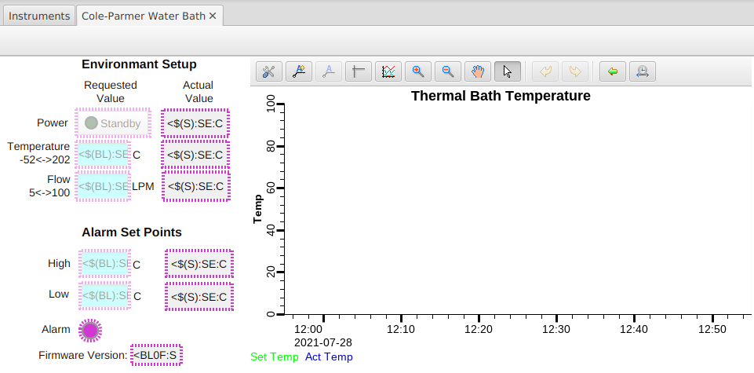

# coleparmer
EPICS support for control and monitoring of a Cole-Parmer PolyStat AD28R-30

The EPICS support is based on [Asyn](http://www.aps.anl.gov/epics/modules/soft/asyn/) and [Stream Device](http://epics.web.psi.ch/software/streamdevice/).

The module provides support for:

 * Water temperature control and feedback
 * Water flow control and feedback
 * Alarm setpoints
 * Temperature tracking display and feedback

